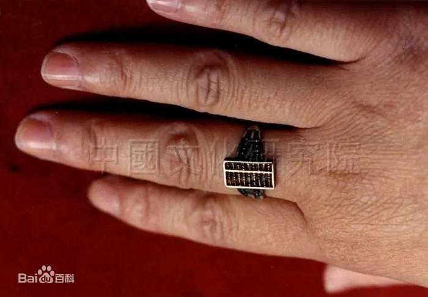
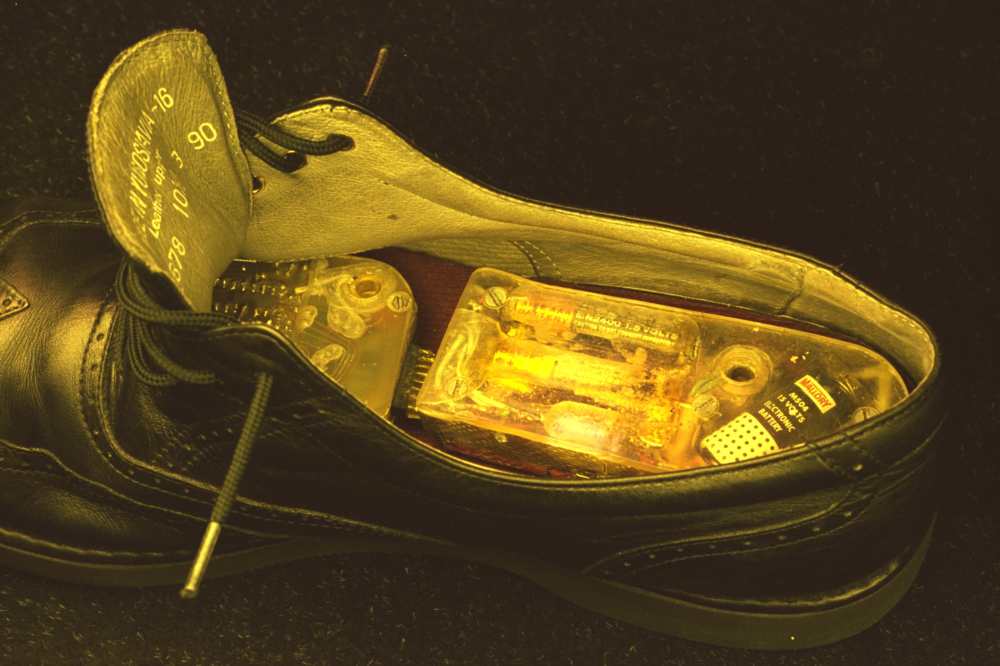
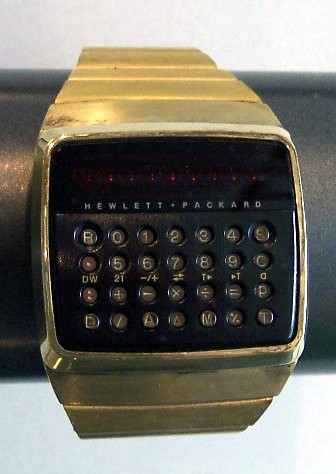
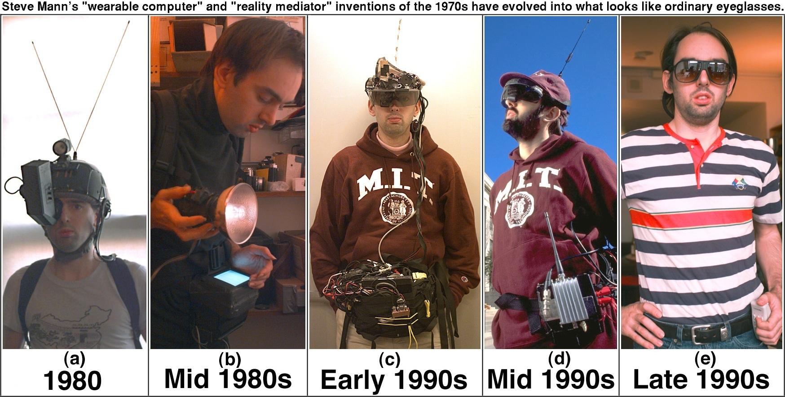
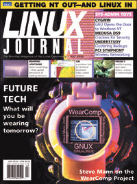

什么是可穿戴技术呢？
任何被设计于穿戴时使用的技术统称为可穿戴技术。主要特点是直接穿戴于使用者身上，或者整合于使用者的衣物或佩戴的配饰。通过与各种硬件（如传感器、显示设备）和软件以及物联网的结合，眼镜、手表这些可穿戴设备拥有了十分丰富的功能。

可穿戴技术的发展进程：
可穿戴式设备与可穿戴式计算机的定义不同，最早的可穿戴设备可以追溯到17世纪中国设计师制造的算盘戒指，以及英国女王伊丽莎白一世在16世纪所佩戴的“戒指手表”。

而在19世纪60年代数学家Edward O. Thorp 和 Claude Shannon为了赢得赌博游戏“俄罗斯转盘”，制造了一些计算机化的计时设备，这些设备被隐藏在鞋子和一盒香烟当中。这也是最早的可穿戴计算机化设备

1970年，袖珍计算器从日本开始成为了一种大众化设备。而在20世纪70年代末，一种更通用的可编程计算器出现，惠普于 1977 年发布HP-01 代数计算器手表。

20世纪80年代，加拿大工程师Steve Mann设计并制造了一款基于6502的背包式可穿戴多媒体计算机，具有文本、图形和多媒体功能以及视频功能（相机和其他摄影系统）。Mann后来成为了可穿戴设备领域的早期活跃研究人员，尤其以1994年创建的可穿戴无线网络摄像头而文明，并开启了生活视频日志的先河。在1998年Maan发明并制造了世界上第一块智能手表，这块手表曾出现在2000年的Linux Journal的封面上，并在ISSCC 2000进行了演示

