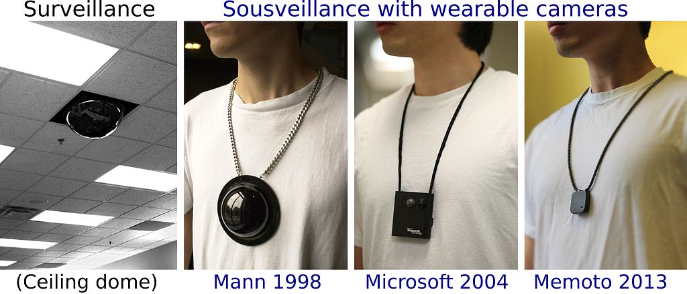
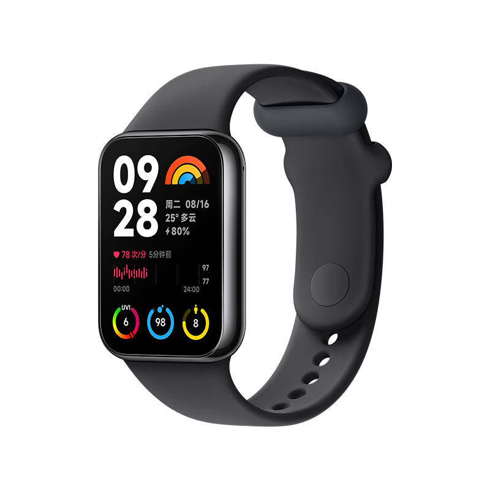

## 什么是可穿戴技术？

当谈论到可穿戴技术时，它是指任何被设计于穿戴时使用的技术。其主要特点是直接穿戴于使用者身上，或者整合于使用者的衣物或佩戴的配饰。通过与各种硬件（如传感器、显示设备）和软件以及物联网的结合，眼镜、手表这些可穿戴设备拥有了十分丰富的功能。

## 可穿戴技术的发展进程

可穿戴式设备与可穿戴式计算机的定义不同，最早的可穿戴设备可以追溯到17世纪中国设计师制造的算盘戒指，以及英国女王伊丽莎白一世在16世纪所佩戴的“戒指手表”。

 

而在19世纪60年代数学家Edward O. Thorp 和 Claude Shannon为了赢得赌博游戏“俄罗斯转盘”，制造了一些计算机化的计时设备，这些设备被隐藏在鞋子和一盒香烟当中。这也是最早的可穿戴计算机化设备

1970年，袖珍计算器从日本开始成为了一种大众化设备。而在20世纪70年代末，一种更通用的可编程计算器出现，惠普于 1977 年发布HP-01 代数计算器手表。

20世纪80年代，加拿大工程师Steve Mann设计并制造了一款基于6502的背包式可穿戴多媒体计算机，具有文本、图形和多媒体功能以及视频功能（相机和其他摄影系统）。Mann后来成为了可穿戴设备领域的早期活跃研究人员，尤其以1994年创建的可穿戴无线网络摄像头而文明，并开启了生活视频日志的先河。在1998年，Maan发明并制造了世界上第一块智能手表，这块手表曾出现在2000年的Linux Journal的封面上，并在ISSCC 2000进行了演示。

从 2000 年代初期开始，可穿戴相机就被用作日益壮大的sousveillance运动（公众成员的活动，通常通过小型可穿戴或便携式个人设备进行记录）的一部分。2008年，Ilya Fridman将隐藏式蓝牙麦克风融入到一对耳环中。

2010年，Fitbit发布了第一个计步器，可穿戴技术追踪诸如步行和心率等信息，这是量化运动的重要部分

2013年，McLear推出了第一款通用的可穿戴设备——NFC戒指。它能够实现比特币支付、解锁其他设备、传输个人识别信息等功能。此外，McLear拥有最早的智能戒指专利，该专利几乎覆盖了所有智能戒指。

而在2013年，首批广泛使用的智能手表之一是三星Galaxy Gear  
在2015年，苹果推出了第一代的Apple Watch

## 热门的可穿戴设备与应用

### 智能手表/手环

智能手表/手环应该是当今最热门的可穿戴设备，比如苹果的Apple Watch、小米的手环、华为Watch

  

### VR眼镜

VR头显是利用头戴式显示设备将人的对外界的视觉、听觉封闭，引导用户产生一种身在虚拟环境中的感觉。其显示原理是左右眼屏幕分别显示左右眼的图像，人眼获取这种带有差异的信息后在脑海中产生立体感。

Apple Vision Pro是苹果公司于2023年6月6日发布的首款头显，具备多个摄像头，用户用手势、眼睛或者语音就可操作控制，可以用来工作、娱乐、沟通的新一代电子产品。 其搭载了苹果公司的M2芯片以及苹果公司专门为Apple Vision Pro设计的R1芯片。它运行visionOS操作系统

### AR眼镜

增强现实（Augmented Reality，简称AR），也有对应VR虚拟实境一词的翻译称为实拟虚境或扩张现实，是指透过摄影机影像的位置及角度精算并加上图像分析技术，让屏幕上的虚拟世界能够与现实世界场景进行结合与交互的技术。这种技术于1990年提出。随着随身电子产品运算能力的提升，增强现实的用途也越来越广。

Google眼镜（Google Glass）是一款配有光学头戴式显示器（OHMD）的可穿戴式电脑，由Google开发，其目标是希望能制造出供给大众消费市场的普适计算设备。Google眼镜以免手持、与智能手机类似的方式显示各种信息。穿戴者透过自然语言语音指令与互联网服务联系沟通。

### TWS耳机

TWS耳机，全称True Wireless Stereo耳机，是一种无线蓝牙耳机

这种耳机通常尺寸小巧，便于佩戴和携带，符合现代人追求的便捷的生活方式，外观设计通常非常简洁，线条流畅，展现出其时尚感和科技感。

由于存在佩戴者会长时间佩戴耳机，耳机设计通常符合人体工学，耳塞或耳挂采用舒适的材质和形状，使佩戴者能够长时间戴着而不感到不适。

为了方便用户操作，许多TWS耳机配备了指示灯来指示耳机的配对状况、电量等信息，有些耳机甚至设计了呼吸等效果以增加其时尚感

### 挑战与突破

#### 技术限制

总的来说，可穿戴设备的技术限制主要在于其尺寸的限制。

可穿戴设备由于其尺寸和重量的限制下，难以通过增大电池尺寸来增加续航，设计者需要在保证设备精致外观的同时，通过对技术的优化尽可能延长电池寿命，增加电池续航。

由于其尺寸的限制，内部的计算和处理能力相对有线，可能限制了设备的功能和性能。在处理大数据和复杂的算法时，可能会导致速度和效率下降、功能限制和应用受限、精确度降低等问题。

为了设备能精准获取信息，为用户提供更好的服务，产品在设计时需要利用先进的传感器技术，获取更加精确的数据，而尺寸有可能会影响到传感器的林敏读和准确性。因此需要设计者在设计产品时考虑数据收集的准确性和完整性

- 电池寿命和续航能力
- 计算和处理能力
- 传感器和数据准确性

#### 用户隐私问题

可穿戴设备通常会收集用户的个人数据，包括运动习惯、心率、睡眠等隐私信息。如何安全地存储、传输和处理这些数据，以保护用户的隐私权成为了一个重要的问题。

而在用户的传输和存储过程中，用户的隐私信息可能会面临被黑客攻击或非法获取的风险，这可能对用户的个人隐私和安全造成严重威胁。

一些可穿戴设备制造商可能会滥用用户的数据，例如将其用于广告定向营销或者出售给第三方。这可能会损害用户的隐私权和权益

- 个人数据保护
- 数据泄漏风险
- 数据滥用和商业用途

为了解决这些问题，可穿戴设备设计师和制造商应严格遵守数据保护和隐私规范，采用加密技术、匿名处理等手段保护用户的隐私信息安全。在设计阶段注重设备的安全新、数据安全新，以及开发安全的数据存储和传输机制也至关重要。

#### 设计可穿戴设备的要点

在设计可穿戴设备时，应考虑以下一些内容
首先是佩戴舒适性，一个可穿戴设备，应当符合人体工程学原理，以确保佩戴着能长时间舒适度佩戴。重量、形状、材料的选择以及佩戴方式都应该考虑，以确保设备的舒适性

对于功能和性能，设计者应平衡设备的功能和性能，考虑设备的尺寸、重量和电池续航能力，以确保设备在提供功能的同时不会过于臃肿或耗电过快。

设备的用户界面和交互设计应简洁直观，易于操作，让用户更轻易地上手、方便地使用设备

可穿戴设备需要具备一定的耐用性和防水性能，以应对日常使用中的碰撞、摩擦和水等因素带来的影响。对材料的耐用性会有一定的要求

设计需要考虑设备未来的可扩展性和其他设备的互操作性。比如上面的Galaxy Gear，由于其只能与Galaxy Note 3和Galaxy Note 10.1 2014 Edition搭配使用，兼容性有限，最终被淘汰

- 佩戴舒适性和人体工学
- 功能与设备之间的平衡
- 友好的用户界面和交互设计
- 耐用性和防水性能
- 可扩展性和互操作性

## 可穿戴技术带来的便利

它使得人们可以更加方便地获取和监控个人健康数据，如心率、步数等，从而更好地管理和改善健康状况。其次，可穿戴设备为人们提供了更加便捷的通信手段，使得沟通更加即时和便利。此外，它也为人们提供了更加高效的工作和生活辅助工具，例如智能手表可以帮助用户更方便地管理日程安排和提醒事项。

可穿戴技术的发展已经为我们的生活带来了诸多便利和新体验。随着技术的不断进步和创新，我们可以期待着更多令人兴奋的发展和应用。
